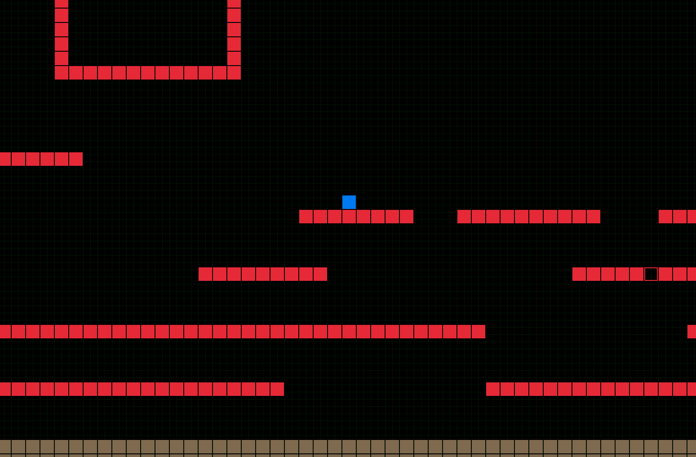

# platformer_sidescrolling

Demonstrating a basic template for creating a side scolling platform game, arrow keys move the blue character, keypad arrows move the camera, F3 to fix the camera to player movement, + / - keypad zoom in / out

  

